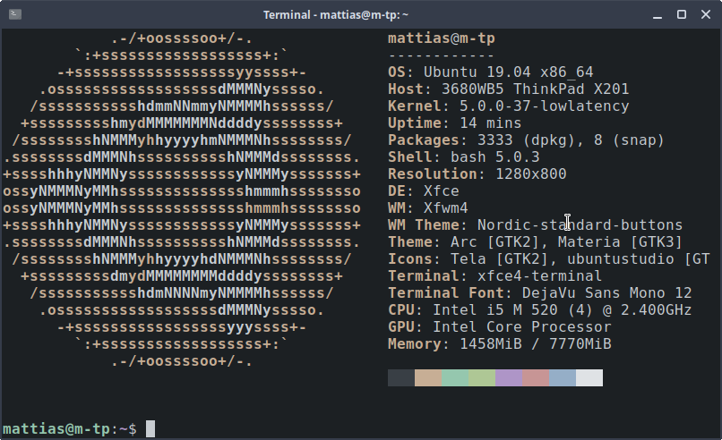

# Linux cheat sheet

## System



I'm running [Ubuntu studio](https://ubuntustudio.org/) on a ThinkPad X201.

Ubuntu Studio comes with a bunch of audio software, like [Pure Data](https://puredata.info/), [Ardour](https://ardour.org/) and many more. 

The feature that got me interested, though, was that it ships with a low-latency kernel.

### Connect to eduroam

Super important for me, du to studying at a university. 

[Guide](https://www.sheffield.ac.uk/cics/wireless/linux)

### Hardware/software info

__List USB devices__

```
$ lsusb
```

__CPU info__

```
$ lscpu
```

__Memory info__

```
$ cat /proc/meminfo
```

__System monitor__

```
$ htop
```

__Check kernel version__

```
$ cat /proc/version
```

## Basic software
### Desktop environment
I use XFCE, that's shipped with Ubuntu Studio. Nothing fancy here.

### Email
I use [Geary](https://wiki.gnome.org/Apps/Geary) for my emails. It's quick and easy to set up, and talks to Gmail (which Thunderbird has had troubles with). To get Gmail up and running, you need to use [app-specific passwords](https://support.google.com/accounts/answer/185833?hl=sv).

## Audio

### KXStudio

Great resource for audio apps. [Link to their website](https://kx.studio/).

To install on Debian/Ubuntu, follow these steps to add their repositories to `apt`:

```
$ sudo apt-get install apt-transport-https gpgv
$ sudo dpkg --purge kxstudio-repos-gcc5
$ wget https://launchpad.net/~kxstudio-debian/+archive/kxstudio/+files/kxstudio-repos_10.0.3_all.deb
$ sudo dpkg -i kxstudio-repos_10.0.3_all.deb
```

Then, run: 

```
$ sudo apt update
```

...and you should be able to find the packages in the Synaptic Package manager (a GUI frontend to `apt`).

In the Synaptic Package manager, you can sort the packages by repository in the lower left corner.

On of the packages is called `kxstudio-recommended-all`, which is what the name suggests. I also recommend these packages from KXStudios:

__Cadence__, a `jackd` frontend, that makes everything easier.

__Carla__, an audio plug-in host.

But there's a bunch of other stuff there.

### Reaper

Cockos are releasing experimental builds for Debian based systems (Ubuntu being one of them). 

[Link](http://reaper.fm/download.php).

Download the one called "Linux x86_64" (meaning that it's for a x86-based processor -- intel -- and in 64 bits). 

Unzip the file, and then open a terminal and go into the unzipped directory with the `cd` command. Inside the directory, run the command:

```
$ sh install-reaper.sh
```

...and you'll be prompted a couple of things. It's pretty straightforward. I've installed it locally (in the ~/opt/ repository) but I don't think it makes a difference if you install it globally (in the /opt/ repository).

I do recommend starting a Jack server before you start Reaper, though.

### SuperCollider

SuperCollider can be downloaded through `apt`, via writing:

```
$ sudo apt install supercollider
```
